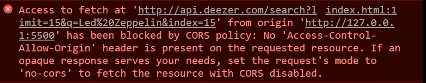

<h1 align="center">
  <br>
  Lyrics Search
</h1>

<p align="center">
 <a href="#-Sobre">Sobre</a> •
 <a href="#-Tecnologias">Tecnologias</a> • 
 <a href="#-Features">Features</a> • 
 <a href="#-O%20que%20eu%20aprendi%20?">O que aprendi</a>
</p>

### 💡 Sobre

Este é um buscador de letras de músicas criado utilizando como base a [aula](https://www.youtube.com/watch?v=sgiTuXGin2I&t=1s&ab_channel=RogerMelo) do professor [Roger Melo](https://github.com/Roger-Melo). Onde eu pude aprender vários conceitos e apliquei algumas features.

### 🛠 Tecnologias

Esse projeto foi desenvolvido com as seguintes tecnologias:

- JavaScript
- HTML/CSS

**API**

- [lyrics](https://lyricsovh.docs.apiary.io/#)

### ⚙ Features

- [x] Estilização "descontraida" (Parallax)
- [x] Pre-loader ao fazer requisições
- [x] Botão para voltar ao escolher uma letra
- [ ] Mobile

### ✍ O que eu aprendi ?

#### Regex (Expressões Regulares)
- Neste projeto pude aplicar o conceito de [expressões regulares](https://developer.mozilla.org/pt-BR/docs/Web/JavaScript/Guide/Regular_Expressions) na prática com a utilização da função ```replace```:

```javascript
var lyric = data.lyric.replace(/(\r\n|\r|\n)/g, '<br>)
```
> O exemplo acima substitui todo caractere (/g) que for um \r (return carrier), \n (line-feed), ou \r\n (return carrier seguido de um line-feed), por uma tag html ```<br>```.<br>**\r** : Caractere que retornar o cursor para o começo da linha<br>**\n** : Quebra de linha

#### Destructuring

- Como o nome já diz - "desestruturação" - o [destructuring](https://youtu.be/htM6esStNo8) é um recurso implementado no ES6 que possibilita desestruturar objetos e arrays. Quando utilizado, facilita na produtividade, usabilidade, e legibilidade do código, principalmente quando usado em argumentos de funções:

```javascript
loja = {
  nome: 'Moda Verão',
  produtos: {
    camisas: {
      cores: ['azul', 'preto', 'vermelho']
    },
    bermudas: {
      cores: ['amarelo', 'vermelho', 'cinza']
    }
  }
};

const { nome, produtos: { camisas: { cores } } } = loja;

console.log(name); // 'Moda Verão'
console.log(cores); // ['azul', 'preto', 'vermelho']
```

[*Exemplo no projeto*](https://github.com/arimariojesus/Lyrics-Search/blob/d3a83b76d1c7daff3017701beda83e80461af100/scripts/app.js#L36-L37)

### Cross-origin resource sharing (CORS)

- O [CORS](https://youtu.be/GZV-FUdeVwE) é uma especificação do W3C que diz se um determinado recurso pode ou não ser acessado por outros domínios fora do próprio domínio ao qual pertence:



> Este erro pode ser resolvido com a utilização de um Proxy: https://github.com/Rob--W/cors-anywhere

[*Exemplo no projeto*](https://github.com/arimariojesus/Lyrics-Search/blob/d3a83b76d1c7daff3017701beda83e80461af100/scripts/app.js#L25)

